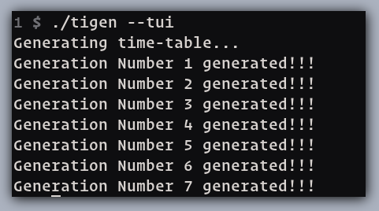
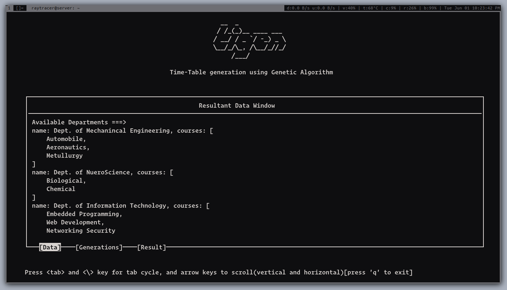
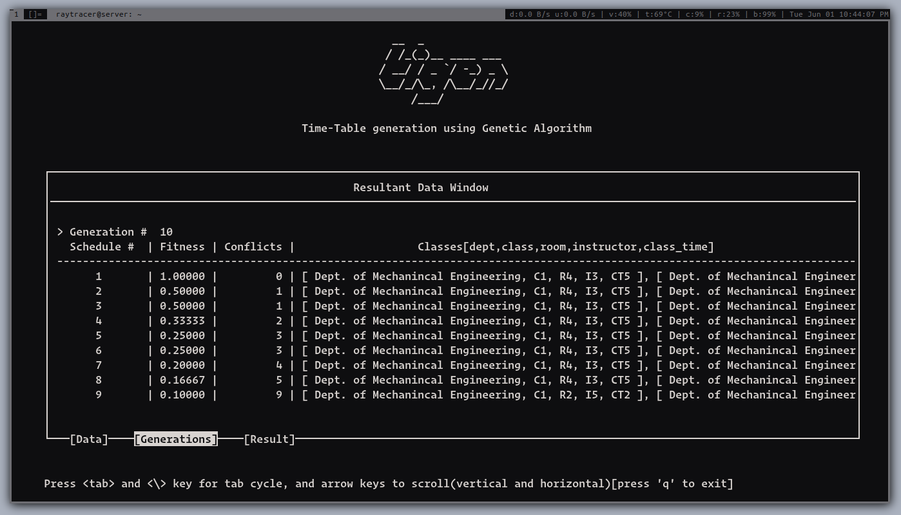
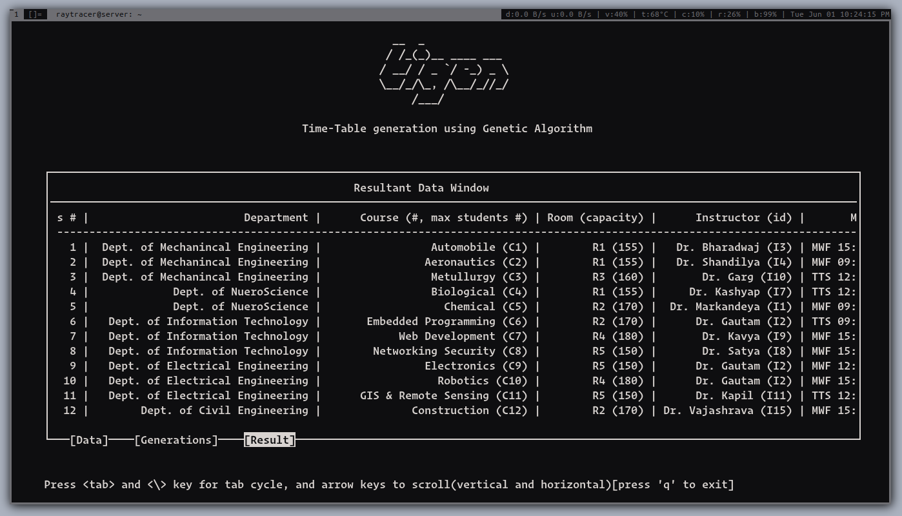

# tigen

Time table generation using Genetic Algorithm.


## How to use

Here's how to use it:

```
Help for tigen:
        When "no argument" is provided, it will show this help.
        Following are the extra arguments you can provide:
                --tui [--debug]   : show output in curses mode.
                --term            : Run algo and print output in terminal.
                --version         : Show version of tigen.
                --help            : Show this help.

        Key combinations to navigate through ncurses window:
                  <keys>                      <movement>
                tab                    : go to next tab(clockwise movement)
                (back-slash)<\>        : go to previous tab(anti-clockwise moment)
                g                      : move to top-most line in result window(vertical)
                G                      : move to bottom-most line in result window(vertical)
                B                      : move to begin of the current result window(horiontal)
                W                      : move to end of the current result window(horizontal)
                h/left arrow           : move left(by 4 char)
                l/right arrow          : move right(by 4 char)
                k/up arrow             : move up(one row at a time)
                l/down arrow           : move down(one row at a time)
                <C-u>/PageUp           : move upon one screen view
                <C-d>/PageDown         : move down one screen view)
                b/Home                 : move one screen view left
                w/End                  : move one screen view right
```


## Build:

You can use `make`_(UNIX Makefiles)_ to build the program. Just do:
```sh
$ make
```
in the root directory of project. Following are the targets provided with `make` for the project:
* make (build the project)
* make all (build the project)
* make debug (build the project using -g flag(inclusion of debug symbols))
* make help (shows the included directory and files used in the building process)
* make clean (clean the project directory of binaries and object files)

## Screenshots:

* **Evolution through Generation:**



* **Data Provided:**



* **Generations Details:**



* **Resultant Schedule:**




## Contributors of the project

* Tarun Singh
* Abhay Shanker Pathak
* Pragati Srivastava

`Note: work in progress`
