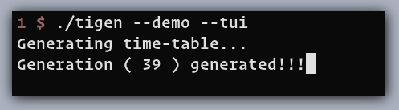
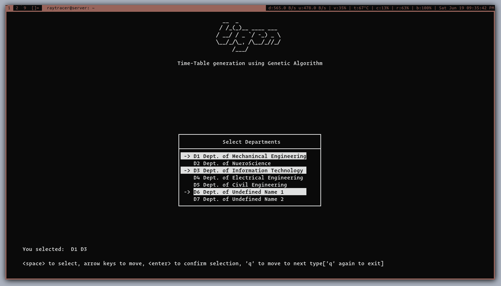
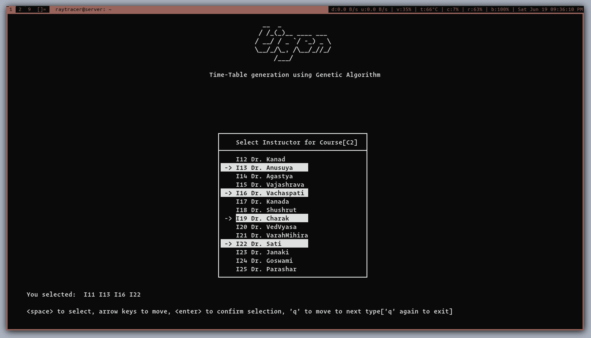

# tigen

Time table generation using Genetic Algorithm.

As of now, you can use `tui`( ncurses ) to select the entities required to
generate the schedule. Data for selection will be provided for main data set,
and the selection can be based according to your need. Selection is provided
for all `5 entities`_( Department, Course, Instructor, Class_time, Room )_. You
can also generate a `demo` schedule which randomly maps the entities to
each other according to given relation from the main data set.

## How to use

Here's how to use it:

```
Help for tigen:
        When "no argument" is provided, it will show this help.
        Following are the extra arguments you can provide:
                --tui  [--debug]      : show output in curses mode.
                --demo [--tui/--term] : creates demo data from main data to show output.
                --version             : Show version of tigen.
                --help                : Show this help.

        Key combinations to navigate through ncurses window:
                <keys>                      <movement>
        -> selection window:
                <space>          : to select the entity
                up/down arrow    : move to select items
                <enter>          : to confirm your selection before proceeding further
                q                : to go to next entity( type ), if pressed again then exits the program
        -> result window:
                tab              : go to next tab(clockwise movement)
                (back-slash)<\>  : go to previous tab(anti-clockwise moment)
                g                : move to top-most line in result window(vertical)
                G                : move to bottom-most line in result window(vertical)
                B                : move to begin of the current result window(horiontal)
                W                : move to end of the current result window(horizontal)
                h/left arrow     : move left(by 4 char)
                l/right arrow    : move right(by 4 char)
                k/up arrow       : move up(one row at a time)
                l/down arrow     : move down(one row at a time)
                <C-u>/PageUp     : move upon one screen view
                <C-d>/PageDown   : move down one screen view)
                b/Home           : move one screen view left
                w/End            : move one screen view right
```


## Build:

Tigen can be build for both Linux/Unix and Windows OS. You can use `CMake` to build the tigen as cross-platform software or you can use `Unix-Makefile` utility for building in Linux systems.

The root directory of the project contains a `CMakelists.txt` file for using with `CMake` and a `Makefile` for using with `make` tool.

### Building with make:

Run the `make` command on root directory of project and this will do all the compiling and linking process. It'll create some directories. Executable for project will be inside in `bin` folder. `make` will provide some more optional arguments, for example `make debug` command will build the executable containing the debug flags. Use `make help` to know more.

### Building with cmake:

To build with `CMake`, first create a `build` directory in root folder of project and enter into it. Enter the following command to build:

```
$ mkdir build
$ cd build
$ cmake -GNinja -DCMAKE_BUILD_TYPE=Debug -DCMAKE_EXPORT_COMPILE_COMMANDS=On -S .. -B .
```

This will setup the build for project. It'll create the files to build the project.

`-GNinja` flag will setup the project build so that `ninja` tool can be used to build the project. If you'll not provide this flag, by default CMake will create Makefile(s) for Linux/Unix systems and NMake files in Windows system.

`-DCMAKE_BUILD_TYPE=Debug` setup the project such that the when the project is build, executable will contain debug flags.

`-DCMAKE_EXPORT_COMPILE_COMMANDS=On` will create a `compile_commands.json` file, which is useful with language-servers and completion engines during coding the project.

`-S ..` points to the source `CMakelists.txt` file

`-B .` points to build directory

`CMake` contains many other flags, options and features. Use `man cmake` or `cmake --help` to know more.

## Screenshots:

* **Evolution through Generation:**



* Department selection



* Instructor selection



* **Data Provided:**


* **Generations Details:**


* **Resultant Schedule:**


## Contributors of the project

* Abhay Shanker Pathak
* Tarun Singh
* Pragati Srivastava

`Note: work in progress`
